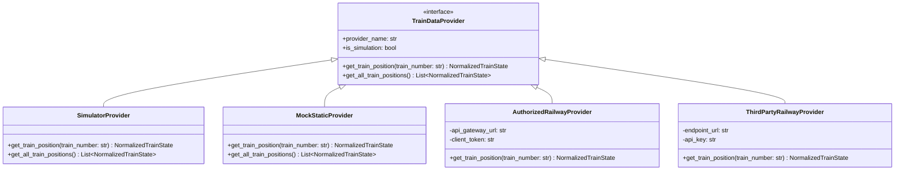

# Data Provider Architecture & Normalized Train Ingestion

## Problem Statement ID: 26028 &bull; Ministry of Railways

---

## 1. Ethical Governance & Data Policy

### Critical Policy Directives
1. **No Web-Scraping**: The platform strictly avoids brittle HTML scraping of passenger enquiry portals (e.g. NTES public websites). Scraping violates terms of service, introduces downtime on schema changes, and is unsuitable for mission-critical railway automation.
2. **Zero False Claims**: The platform will never claim simulated telemetry is an unauthorized live feed from Indian Railways' internal enterprise systems (RTIS/COA/NTES).
3. **Explicit Provenance**: Every API response and user interface component explicitly declares its active data source:
   - `DATA SOURCE: SIMULATION`
   - `DATA SOURCE: LIVE IR FEED` (active only when authorized enterprise tokens are supplied)

---

## 2. Provider-Agnostic Interface (`TrainDataProvider`)

All backend services, prediction models, and real-time streaming sockets consume train telemetry solely via the abstract `TrainDataProvider` contract.

---

## 3. Normalized Train State Schema

Regardless of whether telemetry originates from the simulation clock, a local fixture, or an official gateway, data is normalized into `NormalizedTrainState`:

| Field | Type | Description |
| :--- | :--- | :--- |
| `train_number` | `str` | Official 5-digit Indian Railways train number (e.g. "12302") |
| `timestamp` | `datetime` | UTC timestamp of position transmission |
| `latitude` | `float` | WGS-84 Decimal latitude |
| `longitude` | `float` | WGS-84 Decimal longitude |
| `speed` | `float` | Instantaneous velocity in km/h |
| `bearing` | `float` | Compass heading in degrees (0.0 to 360.0) |
| `current_delay` | `float` | Delay in minutes (+ve: late, -ve: ahead of schedule) |
| `current_station` | `str` | Last cleared scheduled station code |
| `next_station` | `str` | Upcoming station code |
| `data_source` | `str` | "SIMULATION" \| "CRIS_NTES" \| "THIRD_PARTY" |
| `operational_event` | `str` | "NORMAL_OPERATION" \| "CONGESTION" \| "RECOVERY" etc. |

---

## 4. Provider Implementations

1. **`SimulatorProvider` (Active Default)**:
   - Connects to `src/simulator/train_simulator.py`.
   - Simulates physical movement along authentic Indian Railways route track profiles.
   - Dynamic delays and speed modulation triggered via operational disruption events.

2. **`MockStaticProvider`**:
   - Queries static ground-truth records from the relational database.
   - Ideal for reproducible automated unit testing and deterministic regression suites.

3. **`AuthorizedRailwayProvider` (Enterprise Ready)**:
   - Designed for direct integration with Centre for Railway Information Systems (CRIS) and National Train Enquiry System (NTES) / Real-Time Train Information System (RTIS).
   - Requires institutional enterprise API tokens and IP whitelisting.

4. **`RailRadarProvider` (Live Pan-India Telemetry)**:
   - Integrates with the Rail Radar REST API gateway (`https://api.railradar.in/v1`).
   - Authenticated via Bearer token (`Authorization: Bearer <API_KEY>`).
   - Live endpoints utilized:
     - `GET /trains/{train_number}/live`: Real-time delay, current running status, previous/next halt, and station progression.
     - `GET /trains/{train_number}`: Official train metadata, scheduled source/destination coordinates, and average speed.
     - `GET /trains/{train_number}/route`: High-density GeoJSON track coordinates (LineString) for precise sub-kilometer coordinate interpolation.
   - Built-in 20-second TTL memory cache to optimize network latency and respect gateway rate limits.
   - On-demand dynamic train ingestion: Any valid 5-digit Indian Railways train number searched by the user is automatically fetched and persisted in the local SQLite/PostgreSQL schema.

5. **`ThirdPartyRailwayProvider`**:
   - Standardized adapter for commercial transportation data aggregators during development.

