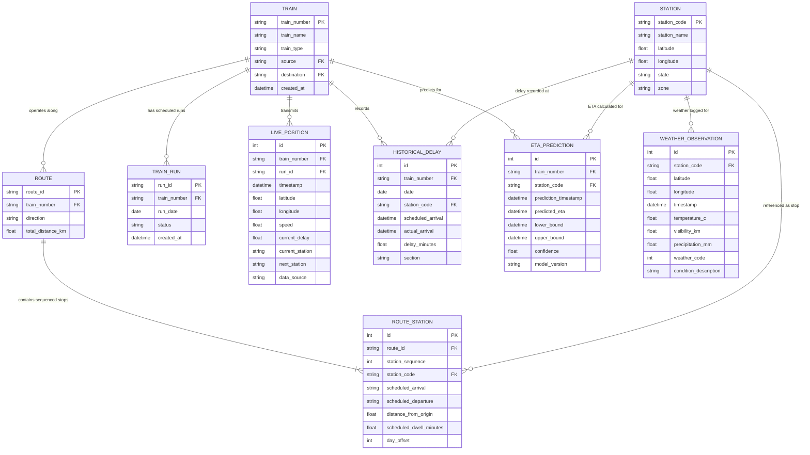

# Database Architecture & Railway Data Model

## Problem Statement ID: 26028 &bull; Ministry of Railways

---

## 1. Architectural Strategy & Technology Choice

The platform data store manages railway topology, scheduled timetables, historical sectional performance, and real-time state telemetry.

### Relational Engine & Geospatial Readiness
- **Database**: PostgreSQL 16+ (Production / Docker) with **PostGIS** extension for geospatial route alignment, buffer calculations, and spatial proximity lookups.
- **Local Development / Prototyping Engine**: Async SQLAlchemy 2.0 with driver abstraction (`aiosqlite` for zero-install local development and `asyncpg` for PostgreSQL/PostGIS).
- **PostGIS Integration Path**: Coordinates are stored as standard `(latitude, longitude)` IEEE 754 floats to maintain portability across both SQLite and PostgreSQL. When deployed against PostgreSQL with PostGIS enabled, a generated spatial point column can be added:
  ```sql
  ALTER TABLE stations ADD COLUMN geom geometry(Point, 4326);
  UPDATE stations SET geom = ST_SetSRID(ST_MakePoint(longitude, latitude), 4326);
  CREATE INDEX idx_stations_geom ON stations USING GIST(geom);
  ```

---

## 2. Entity Relationship Diagram (ERD)



---

## 3. Schema Specifications

### 1. `trains`
Stores the registry of coaching trains.
- `train_number` (VARCHAR(10), PK, Indexed): 5-digit Indian Railways train number (e.g. "12301", "22436").
- `train_name` (VARCHAR(100)): Official train nomenclature.
- `train_type` (VARCHAR(50)): Category ("Rajdhani Express", "Vande Bharat", "Mail/Express").
- `source` (VARCHAR(10)): Origin station code.
- `destination` (VARCHAR(10)): Destination station code.
- `created_at` (TIMESTAMP): Record registration timestamp.

### 2. `stations`
Station node registry with geographic coordinates.
- `station_code` (VARCHAR(10), PK, Indexed): Alpha station code (e.g. "NDLS", "CNB", "HWH").
- `station_name` (VARCHAR(100)): Full name of the railway station.
- `latitude` (FLOAT): WGS-84 Decimal latitude.
- `longitude` (FLOAT): WGS-84 Decimal longitude.
- `state` (VARCHAR(50)): Administrative state.
- `zone` (VARCHAR(20)): Railway zone (e.g. "NR" - Northern Railway, "NCR" - North Central Railway).

### 3. `routes`
Connects trains to physical route profiles.
- `route_id` (VARCHAR(20), PK, Indexed): Unique route identifier (e.g. "R_12302").
- `train_number` (VARCHAR(10), FK `trains.train_number`).
- `direction` (VARCHAR(10)): "UP" or "DOWN".
- `total_distance_km` (FLOAT): Cumulative track length in kilometers.

### 4. `route_stations`
Sequenced timetable stops along each route.
- `id` (INT, PK Autoincrement).
- `route_id` (VARCHAR(20), FK `routes.route_id`, Indexed).
- `station_sequence` (INT): Ordered sequence (1, 2, 3...).
- `station_code` (VARCHAR(10), FK `stations.station_code`, Indexed).
- `scheduled_arrival` (VARCHAR(8)): "HH:MM:SS" (Null for origin).
- `scheduled_departure` (VARCHAR(8)): "HH:MM:SS" (Null for destination).
- `distance_from_origin` (FLOAT): Cumulative track distance from origin in km.
- `scheduled_dwell_minutes` (FLOAT): Planned platform stoppage time.
- `day_offset` (INT): Journey day count (Day 1, Day 2).

### 5. `train_runs`
Specific dated journeys of scheduled trains.
- `run_id` (VARCHAR(50), PK, Indexed): Composite identifier (e.g. `12302_2026-09-10`).
- `train_number` (VARCHAR(10), FK `trains.train_number`, Indexed).
- `run_date` (DATE, Indexed).
- `status` (VARCHAR(20)): "SCHEDULED", "RUNNING", "COMPLETED", "CANCELLED".
- `created_at` (TIMESTAMP).

### 6. `live_positions`
Time-series telemetry feed for active train position.
- `id` (INT, PK Autoincrement).
- `train_number` (VARCHAR(10), FK `trains.train_number`, Indexed).
- `run_id` (VARCHAR(50), FK `train_runs.run_id`, Nullable).
- `timestamp` (TIMESTAMP, Indexed): Time of transmission.
- `latitude` (FLOAT), `longitude` (FLOAT): Current GPS coordinates.
- `speed` (FLOAT): Instantaneous velocity in km/h.
- `current_delay` (FLOAT): Positive indicates late in minutes; negative indicates ahead of schedule.
- `current_station` (VARCHAR(10)): Last cleared station code.
- `next_station` (VARCHAR(10)): Upcoming station code.
- `data_source` (VARCHAR(20)): Data source tag ("SIMULATION", "CRIS_NTES", "THIRD_PARTY").

### 7. `historical_delays`
Historical ground truth sectional performance used to train the ML prediction model.
- `id` (INT, PK Autoincrement).
- `train_number` (VARCHAR(10), FK `trains.train_number`, Indexed).
- `date` (DATE, Indexed).
- `station_code` (VARCHAR(10), FK `stations.station_code`, Indexed).
- `scheduled_arrival` (TIMESTAMP).
- `actual_arrival` (TIMESTAMP).
- `delay_minutes` (FLOAT).
- `section` (VARCHAR(50)): Track block section identifier (e.g. "NDLS-CNB", "CNB-PRYJ").

### 8. `eta_predictions`
Predicted arrival times and uncertainty bounds generated by the dynamic ETA engine.
- `id` (INT, PK Autoincrement).
- `train_number` (VARCHAR(10), FK `trains.train_number`, Indexed).
- `station_code` (VARCHAR(10), FK `stations.station_code`, Indexed).
- `prediction_timestamp` (TIMESTAMP, Indexed).
- `predicted_eta` (TIMESTAMP): Model-derived arrival timestamp.
- `lower_bound` (TIMESTAMP): 10th percentile confidence bound.
- `upper_bound` (TIMESTAMP): 90th percentile confidence bound.
- `confidence` (FLOAT): Prediction confidence score (0.0 to 1.0).
- `model_version` (VARCHAR(50)): Model identifier tag (e.g. "xgb_v1.0.0").

### 9. `weather_observations`
Local weather observations correlated with railway sections.
- `id` (INT, PK Autoincrement).
- `station_code` (VARCHAR(10), Nullable, Indexed).
- `latitude` (FLOAT), `longitude` (FLOAT).
- `timestamp` (TIMESTAMP, Indexed).
- `temperature_c` (FLOAT).
- `visibility_km` (FLOAT): Critical for fog speed restriction modeling.
- `precipitation_mm` (FLOAT).
- `weather_code` (INT): WMO standard weather code.
- `condition_description` (VARCHAR(100)).

---

## 4. Seed Data Provenance Notice

The initial database seed data consists of authentic Indian Railways route timetables, station locations, and sample delays for reference and evaluation:
- Trains: **12301/12302 Howrah Rajdhani Express**, **22436 Vande Bharat Express**, **12952 Tejas Rajdhani Express**.
- Real GPS coordinates for major junctions (New Delhi, Kanpur Central, Prayagraj, Pt. Deen Dayal Upadhyaya / Mughalsarai, Varanasi, Gaya, Dhanbad, Asansol, Howrah, Mumbai Central, Vadodara, Kota).
- This seed data represents baseline timetable schedules and synthetic test telemetry. It is strictly tagged as `data_source = 'SIMULATION'` and does not claim to be an unauthorized live Indian Railways feed.
